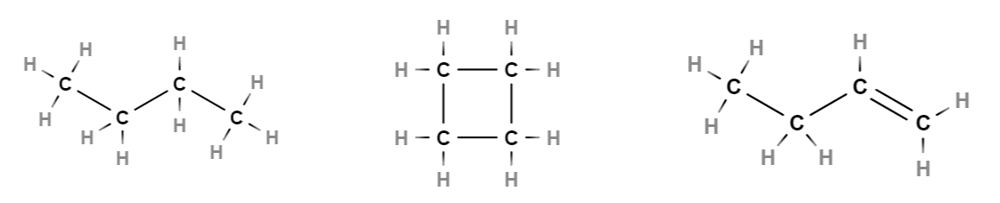
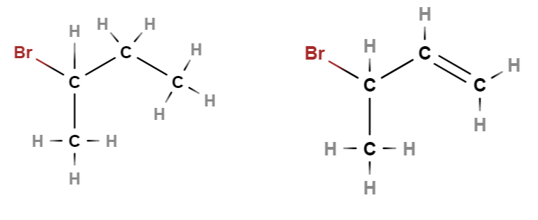

# Luokittelu ja nimeäminen

Hiilivedyt ovat yksinkertaisimpia orgaanisia yhdisteitä, koska niissä on vain kahta alkuainetta, hiiltä ja vetyä. Kivihiili, öljy, bensiini ja maakaasu koostuvat pääasiassa hiilivedyistä. Hiilivetyjä käytetään myös kemianteollisuudessa prosessien raaka-aineina ja liuottimina.

Hiilivetyjä, joissa hiilien välillä on vain yksinkertaisia sidoksia, kutsutaan yleisesti nimellä **alkaani**. Jos molekyylissä on ainakin yksi kaksoissidos, se on yleisnimeltään **alkeeni**, ja jos siinä on ainakin yksi kolmoissidos, se on **alkyyni**.

Toinen tapa luokitella hiilivetyjä on seuraava: 
- tyydyttyneet hiilivedyt: molekyylissä on vain yksinkertaisia sidoksia
- tyydyttymättömät: molekyylissä on  ainakin yksi kaksois- tai kolmoissidos

# Nimeäminen

Hiilivetyjen nimen perusta on pisin yhtenäinen molekyylistä löytyvä hiiliketju. Jos ketju muodostaa renkaan, nimeen tulee etuliite syklo. Ketjun pituus määrää nimen alun seuraavan taulukon mukaisesti:

|Hiilten määrä|1|2|3|4|5|6|7|8|9|10|
|------------|-|--|-|-|-|-|-|-|-|--|
|nimen etuliite|met|et|prop|but|pent|heks|hept|okt|non|dek|

 
Etuliitteen perään tulee pääte, joka kertoo sidostyypeistä:
- Vain yksinkertaisin sidoksia (alkaanit): nimen pääte -aani
- Yksi tai useampi kaksoissidos (alkeenit): nimen pääte -eeni
- Yksi tai useampi kolmoissidos (alkyynit): nimen pääte -yyni

Kaksois- tai kolmoissidoksen paikka ilmaistaan numerolla hiiliketjun siitä päädystä laskettuna, josta on lyhin matka sidokseen. Jos hiiliketjuun liittyy jokin halogeeni, senkin nimi ja paikka liitetään mukaan nimeen. Pisimmistä yhtenäisestä hiiliketjusta lähtevät lyhyemmät ketjut nimetään edellä olevan taulukon mukaisesti, mutta siten, että nimen loppuosa on -yyli. Ketjun sijainti ilmoitetaan numerolla.

Paikkojen numeroinnissa pyritään siihen, että numero olisi mahdollisimman pieni, joten paikan laskeminen aloitetaan siitä päästä molekyyliä, josta on lyhyempi matka numeroitavaan kohtaan – ei siis välttämättä vasemmalta oikealle. Yhdisteessä voi olla myös useampi kuin yksi asia, joiden paikka pitää ilmaista nimessä. Tällöin paikkanumeron voi upottaa nimen sisälle sopivaan kohtaan. Jos hiilirunko muodostaa renkaan, niin nimeen tulee etuliite syklo.

**Esim.** Nimeä seuraavat yhdisteet.

:::{admonition} Ratkaisu
:class: tip, dropdown

Yhdisteiden nimet ovat butaani, syklobutaani ja 1-buteeni.

:::

**Esim.** Nimeä seuraavat yhdisteet.

:::{admonition} Ratkaisu
:class: tip, dropdown

Vasemmalla 2-metyylibutaani, oikealla 3-metyylipentaani.

:::

**Esim.** Nimeä seuraavat yhdisteet.

:::{admonition} Ratkaisu
:class: tip, dropdown

Vasemmalla 2-bromibutaani, oikealla 3-bromi-but-1-eeni. Oikeanpuoleisessa kuvassa hiiliketjun numerointi on laskettu hiiliketjun oikeasta päästä, koska sieltä on lyhyempi matka kaksoissidokseen kuin vasemmasta päästä.

:::

